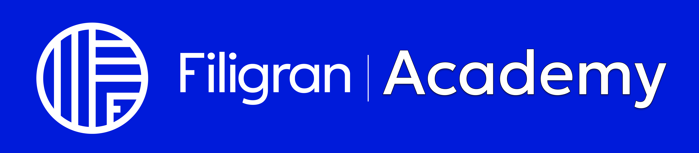
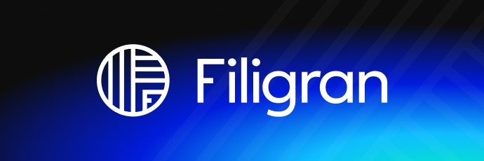

<h1 align="center">
  
</h1>

  
  

## Introduction

Explore the comprehensive learning hub for OpenCTI and OpenBAS, designed for all skill levels - from beginner to advanced. Choose your learning path, advance your knowledge to achieve the official certification, and unlock exciting prizes along the way.

## Suggestion, feedback & bugs

The Filigran Academy is still under heavy development, if you wish to request new content, report bugs or ask for new features, you can directly use the [GitHub issues module](https://github.com/FiligranHQ/filigran-academy/issues).

### Discussion

If you need support or you wish to engage a discussion about the Filigran Academy, feel free to join us on our [Slack channel](https://community.filigran.io). You can also send us an email to contact@filigran.io.

## About

### Authors

Filigran Academy is a product designed and developed by the company [Filigran](https://filigran.io).

